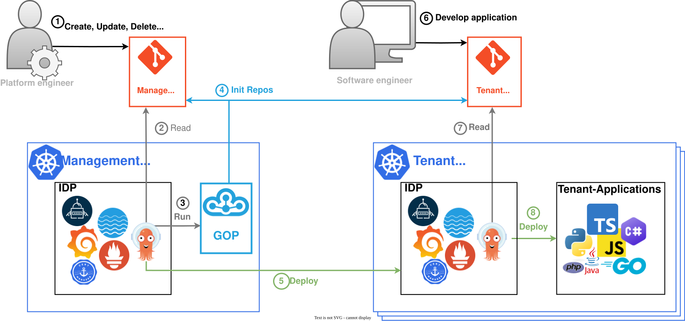

# gop-multi-tenant-multi-cluster-example

IDP as a service: Deploy multiple tenants to dedicated clusters, managed centrally (Hub and spoke) using Argo CD app
sets and [GOP](https://github.com/cloudogu/gitops-playground).

[](https://cdn.jsdelivr.net/gh/cloudogu/gop-multi-tenant-multi-cluster-example@main/IDPaaS.drawio.svg "View full size")

See also 
* [slides of the talk "Repo structures" at CloudLand 2025](https://cloudogu.github.io/gitops-talks/2025-07-cloud-land/#).
* [slides of the talk "Managing tenants using GitOps" at CLC 2025](https://cloudogu.github.io/gitops-talks/2025-11-clc/#/).

## Running locally

Note that you will need the `argocd` [CLI](https://argo-cd.readthedocs.io/en/stable/cli_installation/) and `jq` installed

### Create management cluster / tenant0

```bash
VERSION='0.12.1'
  
INSTANCE=0
bash <(curl -s "https://raw.githubusercontent.com/cloudogu/gitops-playground/$VERSION/scripts/init-cluster.sh") \
  --bind-ingress-port="808$INSTANCE" --cluster-name="c$INSTANCE" --bind-registry-port="3001$INSTANCE"

helm upgrade gop -i oci://ghcr.io/cloudogu/gop-helm --version 0.4.0 -n gop  --kube-context k3d-c${INSTANCE} --create-namespace --values - <<EOF
image:
  tag: ${VERSION}
config:
  application:
    baseUrl: http://localhost
  features:
    argocd:
      active: true
    ingressNginx:
      active: true
  scmm:
    helm:
      values:
        service:
          nodePort: 9999
  content:
    repos:
      - url: https://github.com/cloudogu/gop-multi-tenant-multi-cluster-example
        path: repos/management-cluster
        templating: true
        type: FOLDER_BASED
        overwriteMode: UPGRADE
    variables:
      scmmUrl: http://$(docker inspect k3d-c${INSTANCE}-server-0 | jq -r ".[0].NetworkSettings.Networks.\"k3d-c${INSTANCE}\".IPAddress"):9999/scm
EOF
```

After deployment is finished, you can access the management cluster via
* the Argo CD UI at http://argocd.localhost:8080
* SCM-Manager (git server) UI at http://scmm.localhost:8080  

### Init tenant

```bash
# Push the tenant file right to Git
scripts/init-tenant.sh 1
# Or if you want to print the tenant file (e.g. for demos)
scripts/init-tenant.sh 2 false
```

You can watch the deployment live via the management Argo CD UI http://argocd.localhost:8080

After deployment is finished, you can access the tenant cluster via
* the Argo CD UI at http://argocd.localhost:8081
* SCM-Manager (git server) UI at http://scmm.localhost:8081

Credentials are `admin`/`admin`.

There, you can watch an end-user app being deployed and becoming available at
http://podinfo.tenant1.localhost:8081


### Optional: Use Secret for config

When secret values, like passwords, have to be set in tenant config, a `Secret` is the option of choice.

Here is an example of how to use one:

```bash
cat <<EOF > gop-config.yaml
apiVersion: v1
kind: Secret
metadata:
  name: gop-secret
  namespace: gop
type: Opaque
stringData:
  config.yaml: |
    application:
      username: "admin"
      password: "admin"
EOF

kubectl apply -f gop-config.yaml  --context k3d-c1
```

Add `configSecret: gop-secret` to `global-values.yaml` or `tenant-values.yaml`.
In a production env, these secrets could be created using ESO and vault.

### Delete tenant

#### Secret
```bash
kubectl get secret -n argocd --context k3d-c0 --selector argocd.argoproj.io/secret-type=cluster
# Pick one to delete
```

Or: Delete all

```bash
kubectl delete secret -n argocd --context k3d-c0 --selector argocd.argoproj.io/secret-type=cluster
```

#### Cluster

```bash
k3d cluster rm c1
```

### Optional: Deploy additional app from central argo to tenant clusters

```bash
curl -u admin:admin  'http://scmm.localhost:8080/scm/api/v2/edit/argocd/argocd/create/applications' -X POST \
-F "file0=@repos/management-cluster/extra-app-appset.yaml;filename=file0" \
-F 'commit={"commitMessage":"extra-app-appset","branch":"main","names":{"file0":"/extra-app-appset.yaml"}}'
```